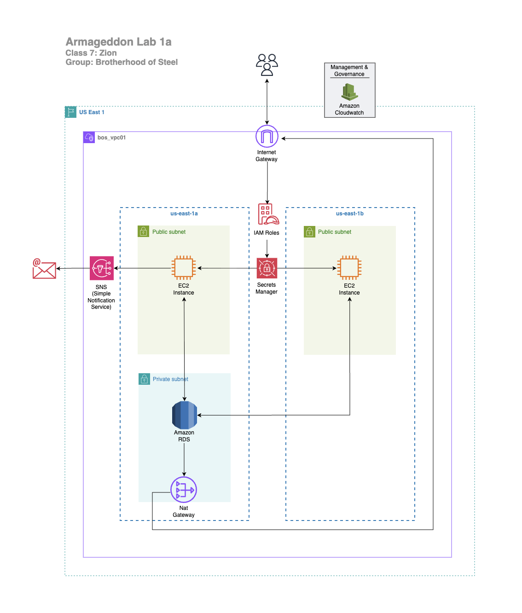

c# meeting #1 - my-armageddon-project-1
### Group Leader: Omar Fleming
### Team Leader: Larry Harris
### Date: 01-04-25 (Sunday)
### Time: 2pm - 4:30 est.
----

### Members present: 
- Larry Harris
- Kelly D Moore
- Dennis Shaw
- Logan T
- Tre Bradshaw
- Bryce Williams
- Jasper Shivers (Jdollas)
- Ted Clayton
- Torray
- Zeek-Miller
- Jay Mallard

-----
### In today's meeting:
- created and instructed everyone to create a Terraform repo in Github to share notes and test the Terraform builds
- went through Lab 1a discussed, seperated Larry's main.tf into portions. We tested trouble shot, spun up the code. Dennis will upload to github and after Larry looks through it, will make it available for everyone to download
- everyone inspect, test and come back with any feedback, suggestions and or comments
- Here is the 1st draft diagram. We want to hear if you guys have any feedback or suggestions for this as well.

-------
### Project Infrastructure
VPC name  == bos_vpc01  
Region = US East 1   
Availability Zone
- us-east-1a
- us-east-1b 
- CIDR == 10.26.0.0/16 

|Subnets|||
|---|---|---|
|Public|10.26.101.0/24|10.26.102.0/24|  
|Private|10.26.101.0/24| 10.26.102.0/24|

-------
### .tf file changes 
- Security Groups for RDS & EC2

    - RDS (ingress)
    - mySQL from EC2

- EC2 (ingress)
    - student adds inbound rules (HTTP 80, SSH 22 from their IP)

*** reminder change SSH rule!!!

-------------
# meeting #2 - my-armageddon-project-1
### Group Leader: Omar Fleming
### Team Leader: Larry Harris
### Date: 01-05-25 (Monday)
### Time: 5pm - 8pm est.
----
### Members present: 
- Larry Harris
- Dennis Shaw
- Jasper Shivers (Jdollas)
- David McKenzie
- Ted Clayton
- LT (Logan T)
______

### In today's meeting

- Review meeting 1
- make sure everyone has their github setup

----
### Fixes
- #### ERROR notice!!!
    - note - recursive error when you re-upload this build you will get an error:
    - "You can't create this secret because a secret with this name is already scheduled for deletion." AWS keeps the secret by default for 30 days after you destroy. Therefore run this code to delete now after each terraform destroy
>aws secretsmanager delete-secret --secret-id bos/rds/mysql --force-delete-without-recovery

- #### changes from week 1 files:
  - variables.tf - line 40 verify the correct AMI #
  - variables.tf - line 46 verfify if you are using T2.micro or T3.micro
  - variables.tf - line 83 use your email
  - delete providers.tf because it is duplicated in the auth.tf 
  - output.tf - line command out the the last two blocks (line 22-27)
  - JSON file - replace the AWS account with your personal 12 digit AWS account#

---------
### Deliverables
- go through the [expected lab 1a deliverables](https://github.com/DennistonShaw/armageddon/blob/main/SEIR_Foundations/LAB1/1a_explanation.md). Starting at #4 on the 1a_explanation.md in Theo's armageddon.

#### Architectural Design
- showing the logical flow 
  - A user sends an HTTP request to an EC2 instance
  - The EC2 application:
  - Retrieves database credentials from Secrets Manager
  - Connects to the RDS MySQL endpoint
  - Data is written to or read from the database
  - Results are returned to the user
- and satisfying the security model
  - RDS is not publicly accessible
  - RDS only allows inbound traffic from the EC2 security group
  - EC2 retrieves credentials dynamically via IAM role
  - No passwords are stored in code or AMIs

screen capture (sc)1

------

#### A. Infrastructure proof

  1. In RDS console, copy the endpoint (you won’t paste it into app because Secrets Manager provides host)

  2. EC2 instance running and reachable over HTTP
     - go to your browser add http:// and and your public IP
     - shows RDS MySQL in the same VPC 
  3. Security group rule showing:  
     - RDS inbound TCP 3306  
     - Source = EC2 security group (not 0.0.0.0/0)  
     - IAM role attached to EC2 allowing Secrets Manager access

sc1

sc2

------

### B. Application Proof
  1. Successful database initialization
  2. Ability to insert records into RDS
  3. Ability to read records from RDS
  4. Screenshot of:
     - RDS SG inbound rule using source = sg-ec2-lab
     - EC2 role attached

- http://<EC2_PUBLIC_IP>/ini
- http://<EC2_PUBLIC_IP>/add?note=first_note

sc3

sc4

- http://<EC2_PUBLIC_IP>/list

sc7

  - If /init hangs or errors, it’s almost always:
    RDS SG inbound not allowing from EC2 SG on 3306
    RDS not in same VPC/subnets routing-wise
    EC2 role missing secretsmanager:GetSecretValue
    Secret doesn’t contain host / username / password fields (fix by storing as “Credentials for RDS database”)

- list output showing at least 3 notes

sc4
sc5
sc6

-----
### C. Verification Evidence

sc10

------

#### go to instances > connect > Session manager (because its in a private subnet you can't access this though public internet) > connect

sc8

sc9

- copy and paste this command in the command line 
- mysql -h bos-rds01.cmls2wy44n17.us-east-1.rds.amazonaws.com -P 3306 -u admiral -p (you can get this from the command line in vscode in the output section)

------

### 6. Technical Verification Using AWS CLI

- it will then prompt for a password
  - password is: Broth3rH00d

sc11

- next type (show databases;)
- next type (use labdb;)

sc12

- next (show tables;)

sc13

- next (select * from notes)

sc14

1) Short answers:  

    A. Why is DB inbound source restricted to the EC2 security group?  
    B. What port does MySQL use?  
    C. Why is Secrets Manager better than storing creds in code/user-data?

notes from